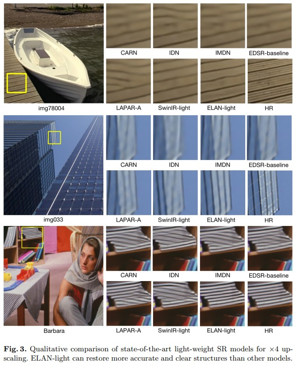
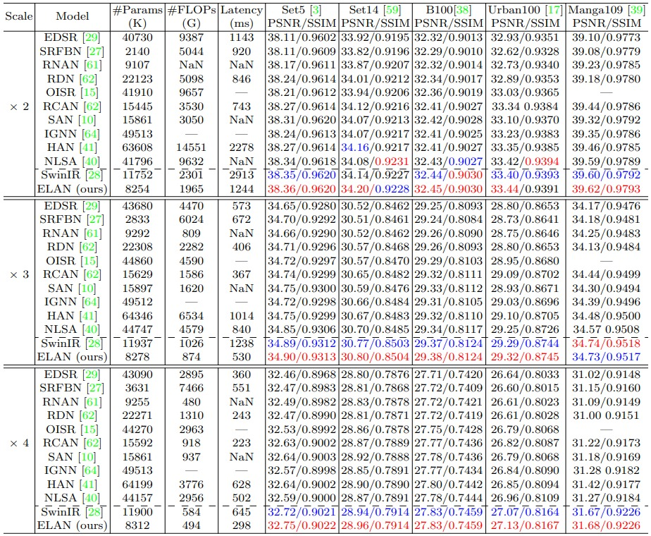
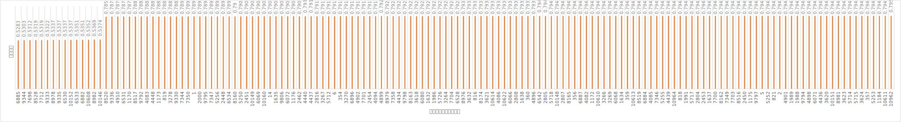
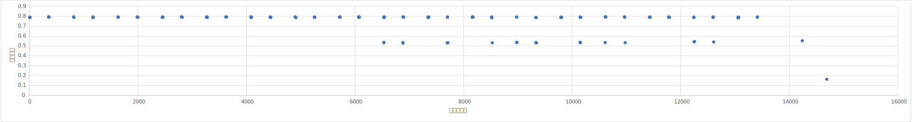
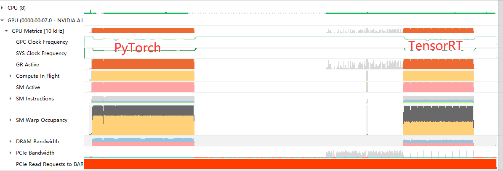
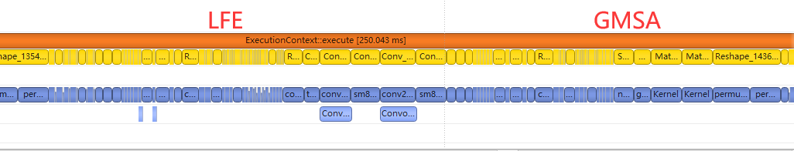
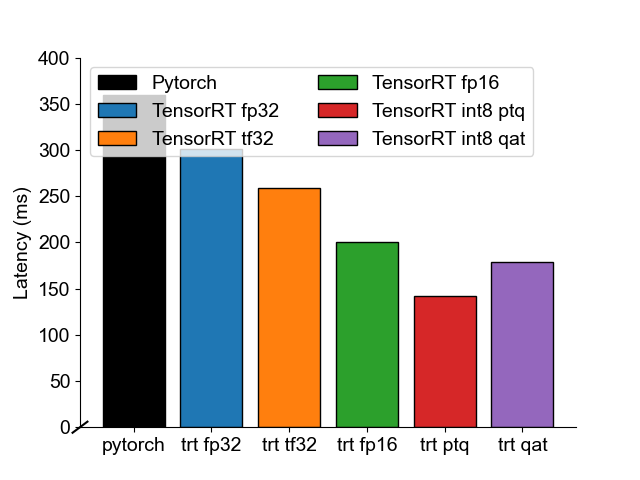

# trt-elan

该项目实现了图像超分辨率算法ELAN的TensorRT加速版本。

:construction:**该项目正在施工**。

## 总述

### 原始模型信息

- 模型名称：ELAN，Efficient Long-Range Attention Network for Image Super-resollution，[arxiv link](https://arxiv.org/abs/2203.06697)，[code link](https://github.com/xindongzhang/ELAN)。已投稿ECCV2022。
- 模型任务：图像超分辨率任务
- 模型特点：轻量级模型；在轻量级限制下，击败SwinIR效果；结合使用卷积与自注意力机制打造基于类Transformer结构但更轻量化的超分模型。

### 优化效果

使用超分任务常用验证集Manga109作为测试基准数据集，使用NVIDIA A10作为测试机器。加速比计算使用TensorRT运行时间比上PyTorch运行时间。

- FP32下可无损精度，加速比为1.19
- TF32下可近无损精度，加速比为1.39
- FP16下可达验证集无损精度，加速比为1.795
- INT8 QAT下可达验证集无损精度，加速比为2.0

### 特性

- [x] 固定尺寸优化
- [ ] 动态尺寸优化
- [x] FP16量化
- [x] 精度优化的FP16量化
- [x] INT8 PTQ
- [x] INT8 QAT
- [ ] LFE Plugin
- [ ] GMSA Plugin

### 项目使用指南

#### 项目结构

#### 项目实验平台

#### 准备数据集

1. 下载数据集：[url] (pwd: al4m)
2. 解压数据集，得到数据集目录`SR_datasets`放至`./datasets/`
3. 在`weights`文件夹中放置以下文件：
   * model_x4_437.pt：PyTorch原始权重文件
   * model_x4_1.pt：QAT过程中训练得到的单epoch QDQELAN训练结果

#### 安装

```sh
docker build -t trt-elan .
```

#### 使用

##### 启动

```sh
docker run --rm -it -v $(pwd)/datasets:/workspace/trt-elan/datasets -v $(pwd)/weights:/workspace/trt-elan/weights -v $(pwd)/src:/workspace/trt-elan/src trt-elan
```

##### 导出ONNX

```sh
python export_onnx.py --config ../configs/elan_x4_pretrained.yml
python surgeon_onnx.py
```

##### 以不同模式导出模型并进行精度对比

###### 直接使用`trtexec`导出模型

```sh
./parse_onxx.sh # 以fp32模式导出模型
./parse_onxx_tf32.sh # 以tf32模式导出模型
./parse_onxx_fp16.sh # 以fp16模式导出模型
python parse_onxx_all_layer.py # 以fp16模式导出模型
```

###### 使用Python TensorRT导出模型

```sh
python parse_onxx_all_layer.py
```

Python脚本`parse_onxx_all_layer.py`中包含以下四种模型导出方式：
* 在FP16模式下将所有卷积层和矩阵乘精度锁定为FP32，输出文件`plans/elan_x4_to_fp32.plan`
* 在FP16模式下将所有卷积层和矩阵乘精度锁定为FP16，输出文件`plans/elan_x4_to_fp16.plan`
* 在FP16模式下将所有卷积层精度锁定为FP32，输出文件`plans/elan_x4_to_fp32_conv.plan`
* 在FP16模式下将所有卷积层精度锁定为FP16，输出文件`plans/elan_x4_to_fp16_conv.plan`
* 在FP16模式下将所有矩阵乘精度锁定为FP32，输出文件`plans/elan_x4_to_fp32_matm.plan`
* 在FP16模式下将所有矩阵乘精度锁定为FP16，输出文件`plans/elan_x4_to_fp16_matm.plan`

###### 进行精度对比

```sh
python test_pref.py
```

Python脚本`test_pref.py`会分别读取以下模型文件进行精度测试，并将其与原始Pytorch模型进行对比：
* `elan_x4.onnx`
* `elan_x4_sed.onnx`
* `elan_x4.plan`
* `plans/elan_x4_to_fp32.plan`
* `plans/elan_x4_to_fp16.plan`
* `plans/elan_x4_to_fp32_conv.plan`
* `plans/elan_x4_to_fp16_conv.plan`
* `plans/elan_x4_to_fp32_matm.plan`
* `plans/elan_x4_to_fp16_matm.plan`

##### 寻找最佳FP16方案

在寻找最佳FP16方案的过程中，我们将FP16模式下分别将每一个卷积层设置为FP32模式并执行测试，以找到对模型精度影响最大的层。

###### 导出模型并进行测试

我们首先FP16模式下分别将每一个卷积层设置为FP32模式，从而生成约200个plan文件，在每个plan文件生成后随即进行测试，进而又生成约200个测试结果：
```python
python test_perf.py
```

此过程在A10 GPU上耗时约72小时。

###### 汇总测试结果

测试完成后，我们汇总所有测试结果，从而找到对模型精度影响最大的层。
```python
python layer_delay_count.py
```

###### 生成最佳FP16方案并测试

```python
python parse_onxx_final.py
python test_perf_final.py
```

## 原始模型

### 模型简介

#### 模型用途

图片超分辨率，即为低清晰度图片填充细节，使之成为高清晰度图片

#### 模型效果

##### 视觉效果



##### 实验效果

此模型的精度超过了目前超分辨率领域顶尖的SwinIR模型，且计算性能极大提升。



#### 业界实际运用情况

此模型为目前超分辨率领域模型计算加速方向的最新研究进展，还未在工业界得到应用。
但超分辨率技术已经广泛应用于视频和游戏画质增强中。NVIDIA DLSS(深度学习超采样)便是其中的代表。DLSS利用 GeForce RTX™ GPU 上的专用 AI 处理单元 - Tensor Core 将视觉保真度提升至全新高度。DLSS 利用深度学习神经网络的强大功能提高帧率和分辨率，为游戏生成精美清晰的图像。

#### 模型特色

模型的主体结构于基于Swin Transformer的SwinIR模型相同，但对其中的自注意力计算过程进行了改进：

* 提出一种新的自注意力操作GMSA(Group-wise Multi-scale Self-Attention)
  * 将特征矩阵的各通道划分为不同的组，每个组应用不同的patch大小，最后将计算结果进行拼接，从而可以通过调整各通道对每个组的分配情况灵活地调节计算量，可避免patch过大带来的计算量增长和patch过小导致的输出质量下降
* 改进了现有的自注意力计算过程，使之更适合并行计算
  * 将LayerNorm改为BatchNorm并与卷积操作合并，从而减少element-wise操作
  * 使用同一个操作计算K和Q矩阵，并在对称高斯空间计算相似度，从而减少1x1卷积计算并节约内存
  * 在第一层之后的自注意力层不再计算K和Q矩阵，而用上述第一层K和Q矩阵在对称高斯空间计算得到的相似度结果与各层的V矩阵相乘，从而节约大量计算资源

### 模型优化的难点

* 如上节所述，此模型中所使用的并非标准的Transformer模块，而是针对并行加速进行了一些改进，因此无法使用TensorRT社区中现有的Transformer模块实现。
* 此模型对Transformer模块的改进是专门针对并行加速进行的，因此在TensorRT中有很大的优化空间，虽然trtexec可以完成一部分的优化工作，但由于其计算过程的独特性，许多优化操作仍需要通过编写插件手动进行

## 优化过程

### 预处理部分的不同处理方式

ELAN超分模型在初始时有一个比例化图像剪裁的预处理工作，这部分实际也是由多个OP组成的，所以可以被TensorRT加速。

- 但TensorRT 8.4GA暂不支持模运算操作，为此需要对于MOD_13 OP `a % b` 使用 `a - a // b * b`代替，即使用一个SUB和一个DIV代替。

- 然而接下来遭遇了ReflectPadding不成功支持的BUG，这与[Release TensorRT OSS v8.2.0 EA · NVIDIA/TensorRT](https://github.com/NVIDIA/TensorRT/releases/tag/8.2.0-EA)中对于N维ReflectPadding提供支持的描述矛盾，且在全网已有多个相关帖子指向这一不支持问题，我们认为这是一个值得关注的BUG，书写在了后续的[BUG报告](https://github.com/liu-mengyang/trt-elan#bug报告)中。对于该问题我们的处理是暂时跳过预处理部分，舍弃这一部分的TensorRT加速，优先处理网络运算主体部分。当然，也可以参考我们提出该问题后，NVIDIA及时响应给出的[workaround](https://github.com/NVIDIA/trt-samples-for-hackathon-cn/tree/master/cookbook/06-PluginAndParser/pyTorch-PadNode)。

### FP32导出

FP32的导出十分顺利，直接导出即可，几乎不存在精度误差。

### TF32导出

TF32的导出也十分顺利，直接导出即可，存在可以被忽略的精度误差。

### FP16导出

FP16的直接导出在张量测试中会遭遇较为严重的精度误差，为此需要进行分析与修正工作。

#### 精度问题分析

##### 定位导致精度问题的层种类

ELAN模型中所包含的乘法计算层主要有矩阵乘和卷积层。于是，我们在FP16模式下分别测试了将所有矩阵乘锁定为FP32导出的模型和将所有卷积层锁定为FP32导出的模型。
实验结果表明，将所有卷积层锁定为FP32导出的模型精度与FP32模式导出的模型精度相当，而将所有卷积层锁定为FP32导出的模型精度与FP16模式导出的模型精度相当，这表明导致精度问题的层是模型中的卷积层。

##### 定位导致精度问题的层位置

当确定了精度问题在模型的卷积层中后，接下来我们通过单独将每一个卷积层锁定为FP32后测试精度的方式统计了每一个卷积层对FP16导出模型精度的影响。

我们的测试步骤如下：

1. 将模型设置为FP16模式
2. 选择一个卷积层，记下层编号，将其精度设置为FP32
3. 导出模型，测试模型与Pytorch模型的相对误差，记下测试结果
4. 回到步骤1

于是，我们得到了一系列卷积层编号与模型相对误差的对应关系，将其按相对误差排序后绘制为柱状图。结果如下：



结果表明，只有少部分卷积层可以在设置为FP32后让模型相对误差从0.8降低至0.5；大部分卷积层对模型相对误差影响不大。

进一步，我们还绘制了层编号与模型相对误差的对应关系图，结果如下：



很明显，这些对精度影响较大的卷积层都在ELAN模型结构的解码器部分，且大都位于解码器基本模块的相同位置。

#### 精度问题修正

于是，为了获得最大的加速性价比，我们在FP16模式下将这些对精度影响较大的卷积层计算精度锁定为FP32。以这种方式导出的模型与其他方式对比，其结果如下：

| 导出模式                                       | 计算时间(ms) | 平均相对误差 |
| ---------------------------------------------- | ------------ | ------------ |
| TF32模式直接导出                               | 261.56       | 0.0141       |
| FP32模式直接导出                               | 256.76       | 0.0125       |
| FP16模式直接导出                               | 178.56       | 0.7911       |
| FP16模式下将所有卷积层锁定为FP32导出           | 245.60       | 0.0187       |
| FP16模式下对精度影响较大的卷积层锁定为FP32导出 | 202.26       | 0.147        |

可以看到，以这种方式导出的模型其计算速度相比于FP16模式直接导出慢大约13%，但相对误差下降了75%。

#### 总结

本节实验表明，由于16位浮点数表示范围限制等问题，直接将神经网络所有层计算精度修改为16位浮点会对模型输出结果的精度产生较大影响，但每一层对模型输出结果的影响各不相同。在TensorRT中，通过将少量层锁定为FP32的方式，可以将模型的精度损失控制在一定范围，从而在模型精度和计算速度方面取得平衡。

### INT8量化

对于INT8量化工作，本仓库提供了PTQ（Post Training Quantization）与QAT（Quantization-Aware Training）两种实现。限于大赛规定的比赛时间，在性能测评中QAT方案并没有给出一个完全训练好的plan，但提供的相关实现代码已十分完整。

#### PTQ方案

PTQ的过程较为简单，构造了一个基于Manga109验证集继承`trt.IInt8EntropyCalibrator2`类的校准器，结合校准器对FP32精度的ONNX模型进行了PTQ INT8量化。这一方案操作简单，耗时短，但得到的精度结果并不喜人。

#### QAT方案

QAT的过程分为如下几个步骤：

1. 使用`pytorch_quantization`包中提供的`QuantConv2d`替换占据推理大部分计算时长的PyTorch卷积层，构造`QDQELAN`；
2. 在PyTorch中对`QDQELAN`进行完整训练；
3. 在PyTorch中对完整训练好的`QDQELAN`基于训练集进行校准与微调；
4. 导出携带QDQ层的`QDQELAN`ONNX模型；
5. 转换`QDQELAN`ONNX模型为INT8 TensorRT模型；


### Profiling分析

通过nvidia nsight system可以分析ELAN网络在TensorRT加速前后的GPU执行开销变化信息，以及探查网络中每一个算子的执行占比，以此查明网络中的性能瓶颈所在并进行针对性优化。

首先对比GPU使用率情况：



可以发现在加速前也就是PyTorch下运行ELAN的GPU使用率就很高了，说明计算十分密集，很难仅通过算子选择来进一步提升推理速度。出现这种情况也正常，尽管ELAN是以轻量化为目的而设计的网络，但我们选择的是ELAN的最大规模模型以及使用的输入分辨率也比较高，计算密度自然较高。可以预想进行多批量压力测试下，得到的时延结果估计也是随批量大小线性增长的。

接下来查看算子的执行情况：



ELAN的主体是由多个ELAB块组成的，而ELAB块主要由LFE和GMSA组成，通过profiling，可以看到主要的计算开销集中在LFE的卷积运算和GMSA的注意力机制矩阵运算中，尤其是LFE的卷积运算占据了大部分计算开销。但GMSA中的很多Reshape操作也占用了大量的计算开销，也许出现大量Reshape操作是由ONNX的图转换造成的，也许这些层可以得到精简或数据复用，为此设计针对GMSA的Plugin也许是有意义的。但是对于LFE而言，它的大量计算都由卷积承担，TensorRT对卷积的优化已经非常好了，设计Plugin能得到的收益有限。尽管看到了实现Plugin能得到的收益潜力，但开发Plugin的代价较大，本项目并没有完成它。

此外，profiling揭示的卷积运算占比重这一现象指导了QAT int8仅对卷积进行量化即可获得客观的加速比。

## 精度与加速效果

- 使用超分任务常用验证集Manga109作为测试基准数据集，使用NVIDIA A10作为测试机器。

- 每次测试都会先进行10次推理的warm-up，再进行100次性能采集。加速效果取性能平均值进行计算。
- 加速比计算使用TensorRT运行时间比上PyTorch运行时间。
- 由于QAT量化耗时较长，本节对于量化精度的度量基于训练1代微调1代的模型进行分析。

### 加速效果

单批量下，加速效果如下图所示：



### 验证集精度

| 项目                    | PSNR  | SSIN   |
| ----------------------- | ----- | ------ |
| PyTorch                 | 31.51 | 0.9232 |
| TensorRT FP32           | 31.51 | 0.9232 |
| TensorRT TF32           | 31.51 | 0.9232 |
| TensorRT FP16           | 31.51 | 0.9231 |
| TensorRT FP16 optimized |       |        |

### 张量对齐精度

以PyTorch原始模型推理结果作为基准测试优化后模型的张量对齐精度。

测量指标：

- max-a0：绝对误差最大值
- med-a0：绝对误差中位数
- mea-a0：绝对误差平均值
- max-r0：相对误差最大值
- med-r0：相对误差中位数
- mea-r0：相对误差平均值

| 项目                    | max-a0 | med-a0 | mea-a0 | max-r0 | med-r0 | mea-r0 |
| ----------------------- | ------ | ------ | ------ | ------ | ------ | ------ |
| ONNX runtime            |        |        |        |        |        |        |
| TensorRT FP32           |        |        |        |        |        |        |
| TensorRT TF32           |        |        |        |        |        |        |
| TensorRT FP16           |        |        |        |        |        |        |
| TensorRT FP16 optimized |        |        |        |        |        |        |

QAT的INT8量化能带来更好的性能，但它需要重新训练模型，这部分工作仍在推进中，故当前本仓库仅提供了QAT的完整代码，但QAT的完整方案还在生成测试中。

### 量化精度对比

| 项目                                                 | PSNR  | SSIN   |
| ---------------------------------------------------- | ----- | ------ |
| PyTorch (1 train epoch)                              | 28.36 | 0.8739 |
| TensorRT INT8 PTQ (full)                             | 10.04 | 0.4834 |
| TensorRT INT8 QAT (1 train epoch, 1 fine-tune epoch) | 29.28 | 0.8922 |

## 仍然存在的问题

- 暂时未能支持Dynamic Shape

## Bug报告

### ReflectPadding Parse Error

已发布于[ReflectPadding Parse Error · Issue #34 · NVIDIA/trt-samples-for-hackathon-cn ](https://github.com/NVIDIA/trt-samples-for-hackathon-cn/issues/34)。

- Environment

  - NVIDIA A10
  - TensorRT 8.4GA
  - CUDA 11.6
  - CuDNN 8.4.0
  - CUBLAS 11.9.2
  - NVIDIA Driver 510.73.08

- Reproduction Steps

  - CASE

    - `unit.py`: Generate ONNX graph with a `Pad` layer with `reflect` mode.

      ```python
      import torch
      import torch.nn as nn
      import torch.nn.functional as F
      
      
      
      class ReflectPad(nn.Module):
          def __init__(self):
              super(ReflectPad, self).__init__()
      
          def forward(self, input):
              out = F.pad(input, (0, 1, 0, 2), "reflect")
              return out
      
      input = torch.arange(9, dtype=torch.float).reshape(1, 1, 3, 3).cuda()
      print(input)
      rp = ReflectPad().cuda()
      out = rp(input)
      print(out)
      
      torch.onnx.export(rp,
                        input,
                        "unit.onnx",
                        input_names=["input"],
                        output_names=["output"],
                        verbose=True,
                        keep_initializers_as_inputs=True,
                        opset_version=13,
                        dynamic_axes={"input": {0: "batch_size"}})
      ```

    - `parse.sh`: parse the onnx graph generated

      ```sh
      #!/usr/bin/env bash
      python3 unit.py
      
      trtexec \
              --onnx=unit.onnx \
              --explicitBatch \
              --minShapes=lr:1x3x64x64 \
              --optShapes=lr:1x3x80x80 \
              --maxShapes=lr:1x3x120x120 \
              --saveEngine=unit.plan \
              --workspace=40960 \
              --buildOnly \
              --noTF32 \
              --verbose \
      ```

  - Run this case:

    ```sh
    bash parse.sh
    ```

- Expected Behavior

  - Reffered from [Release TensorRT OSS v8.2.0 EA](https://github.com/NVIDIA/TensorRT/releases/tag/8.2.0-EA), TensorRT parser supported `Pad` layer in ONNX, especially ND padding, along with `reflect` padding mode.
  - So that this case can parse the graph and generate a TensorRT plan successfully.

- Actual Behavior

  - Error occurred:

    ```sh
    [06/27/2022-11:15:47] [E] [TRT] ModelImporter.cpp:776: --- End node ---
    [06/27/2022-11:15:47] [E] [TRT] ModelImporter.cpp:779: ERROR: ModelImporter.cpp:180 In function parseGraph:
    [6] Invalid Node - Pad_13
    [shuffleNode.cpp::symbolicExecute::392] Error Code 4: Internal Error (Reshape_3: IShuffleLayer applied to shape tensor must have 0 or 1 reshape dimensions: dimensions were [-1,2])
    [06/27/2022-11:15:47] [E] Failed to parse onnx file
    [06/27/2022-11:15:47] [I] Finish parsing network model
    [06/27/2022-11:15:47] [E] Parsing model failed
    [06/27/2022-11:15:47] [E] Failed to create engine from model or file.
    [06/27/2022-11:15:47] [E] Engine set up failed
    &&&& FAILED TensorRT.trtexec [TensorRT v8401] # trtexec --onnx=unit.onnx --explicitBatch --minShapes=lr:1x3x64x64 --optShapes=lr:1x3x80x80 --maxShapes=lr:1x3x120x120 --saveEngine=unit.plan --workspace=40960 --buildOnly --noTF32 --verbose
    
    ```

- Additional Notes

  - After I propose this problem, NVDIA give a workaround can be used to solve this problem temporally: [padNode-war](https://github.com/NVIDIA/trt-samples-for-hackathon-cn/tree/master/cookbook/06-PluginAndParser/pyTorch-PadNode) .
  - There are many existing posts with this problem need help:
    - [Reflect padding in TensorRT - Deep Learning (Training & Inference) / TensorRT - NVIDIA Developer Forums](https://forums.developer.nvidia.com/t/reflect-padding-in-tensorrt/187326)
    - [Pad opset 11 not supported · Issue #378 · onnx/onnx-tensorrt (github.com)](https://github.com/onnx/onnx-tensorrt/issues/378)

## 相关的项目

- ELAN算法的官方仓库：[xindongzhang](https://github.com/xindongzhang)/[ELAN](https://github.com/xindongzhang/ELAN)

